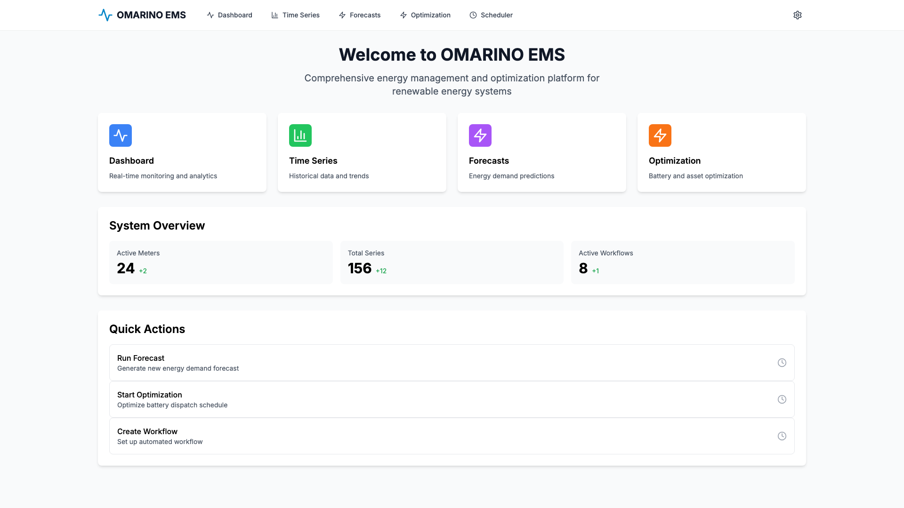
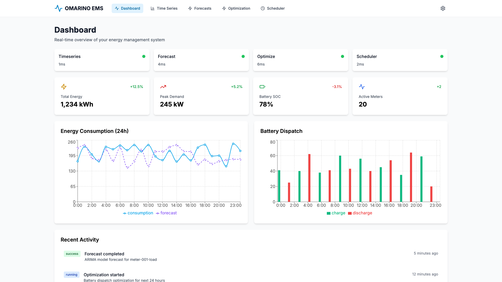
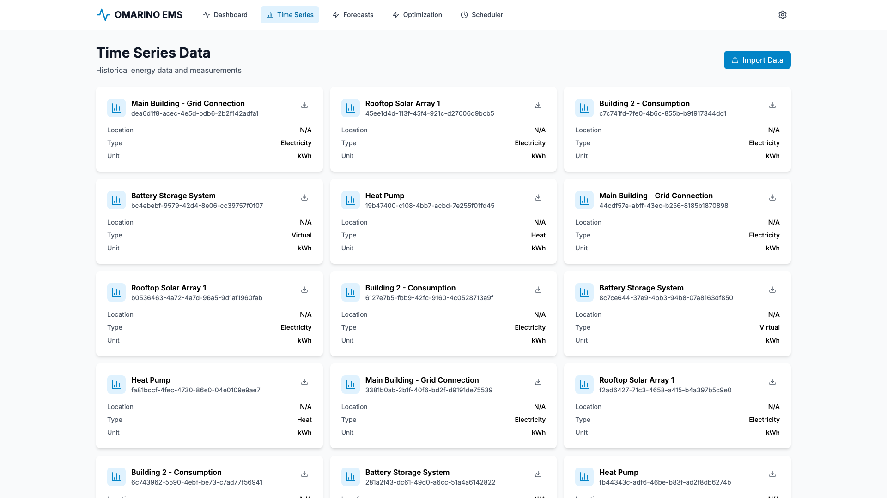
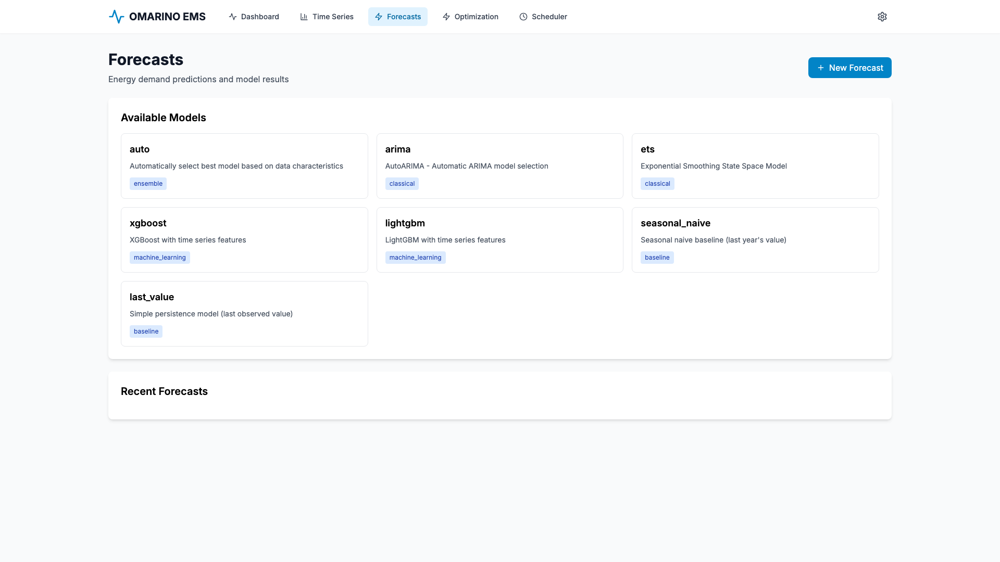
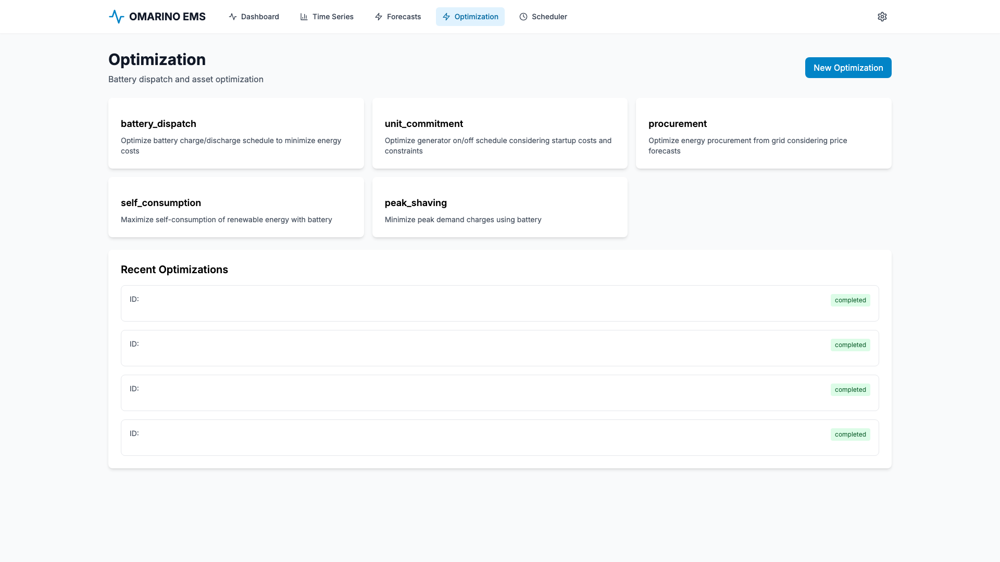
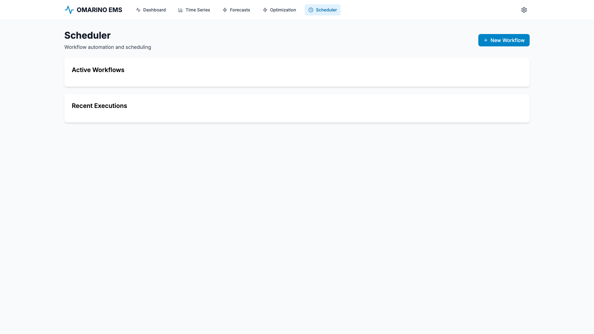

# OMARINO EMS Suite

[](https://github.com/OMARINO-DE/omarino-ems-suite/actions/workflows/ci-timeseries.yml)
[](https://github.com/OMARINO-DE/omarino-ems-suite/actions/workflows/ci-forecast.yml)
[](https://github.com/OMARINO-DE/omarino-ems-suite/actions/workflows/ci-optimize.yml)
[](https://github.com/OMARINO-DE/omarino-ems-suite/actions/workflows/ci-gateway.yml)
[](https://github.com/OMARINO-DE/omarino-ems-suite/actions/workflows/ci-scheduler.yml)
[](https://github.com/OMARINO-DE/omarino-ems-suite/actions/workflows/ci-webapp.yml)
[](https://github.com/OMARINO-DE/omarino-ems-suite/actions/workflows/ci-e2e.yml)
[](https://github.com/OMARINO-DE/omarino-ems-suite/blob/main/LICENSE)

# OMARINO EMS Suite

> **Modern microservices platform for energy management systems**  
> Open-source solution for time-series data, forecasting, and optimization

## 🚀 Live Demo

**Try it now:** [https://ems-demo.omarino.net](https://ems-demo.omarino.net)

Experience the full platform with:
- Interactive forecasting with multiple ML models
- Energy optimization simulations
- Real-time time-series data visualization
- Workflow scheduling and automation

## 🎯 Overview

OMARINO EMS Suite is a modern, containerized microservices platform designed for energy management systems. It provides:

- **⏱️ Time-series ingestion & storage** – Meters, SCADA, market data with versioning and lineage (PostgreSQL + Timescale)
- **📊 Forecasting** – Deterministic and probabilistic forecasts for loads, renewable feed-in, and prices (Python ML/DL stack)
- **⚡ Optimization** – LP/MIP/NLP for storage, unit commitment, procurement, and VPP dispatch (Pyomo + HiGHS/CBC)
- **🔄 Scheduler & orchestration** – Automated imports, forecasts, optimizations, and reporting (Quartz.NET with JSON DAGs)
- **📐 Market & regulatory rules** – Extensible plugin system for compliance and settlement
- **🌐 Web dashboards & APIs** – Role-based access, audit trails, observability (Next.js + ASP.NET Core)
- **🔌 Edge-friendly** – Robust to temporary network loss with buffer + retry

## 📸 Screenshots

### Home Dashboard


### Analytics Dashboard


### Time Series Management


### Forecasting


### Optimization


### Workflow Scheduler


## 🏗️ Architecture

**Monorepo with Dockerized Microservices:**

```
omarino-ems-suite/
├── api-gateway/          # ASP.NET Core – Auth, routing, rate limiting
├── timeseries-service/   # ASP.NET Core – PostgreSQL/Timescale ingestion
├── forecast-service/     # Python FastAPI – scikit-learn, statsmodels, N-HiTS
├── optimize-service/     # Python FastAPI – Pyomo + HiGHS/CBC solvers
├── scheduler-service/    # ASP.NET Core – Quartz.NET DAG execution
├── webapp/               # Next.js + TypeScript – Dashboards, job control
├── shared/               # Schemas, OpenAPI, generated clients
├── infra/                # Docker Compose, Prometheus, Grafana
├── docs/                 # Architecture, ADRs, API docs, runbooks
└── samples/              # Demo CSV data, rule packs, notebooks
```

## 🚀 Quick Start

### Prerequisites

- Docker Desktop or Docker Engine + Docker Compose
- (Optional) VS Code with Dev Containers extension

### Run Locally

```bash
# Clone the repository
git clone https://github.com/OMARINO-DE/omarino-ems-suite.git
cd omarino-ems-suite

# Copy environment template
cp .env.example .env

# Start all services
make up
# Or: docker-compose up -d

# View logs
docker-compose logs -f

# Access the web UI
open http://localhost:3000

# API Gateway
open http://localhost:5000/swagger

# Stop all services
make down
```

### Dev Container (Recommended)

1. Open the project in VS Code
2. Click "Reopen in Container" when prompted
3. All dependencies (Node 20, Python 3.11, .NET 8, PostgreSQL tools) are pre-installed
4. Run `make test` to verify setup

## ✨ Latest Updates (October 2025)

### 🎨 Frontend Improvements
- **Server-Side Rendering (SSR)**: Migrated all data-fetching pages to Next.js SSR for improved performance and SEO
  - Forecasts, Optimization, Scheduler, and Time Series pages now use server components
  - Eliminates CORS issues by using internal Docker network for server-side requests
  - Client components hardcoded to use public API URL for browser-side interactions

- **Manual Data Refresh**: Added refresh buttons to key pages
  - Forecasts, Optimization, and Scheduler pages now have manual refresh capability
  - Uses `router.refresh()` to trigger server-side data re-fetch
  - Provides visual feedback during refresh operations

- **Enhanced Optimization Details Modal**: Redesigned optimization detail view
  - Displays optimization status with color-coded indicators
  - Shows cost breakdowns (total, energy, grid costs)
  - Presents solver information and error messages
  - Supports failed, pending, and completed optimizations

### 🔧 Backend Fixes
- **Database Schema Updates**: Relaxed NOT NULL constraints for better error handling
  - Made `objective_function`, `start_time`, and `end_time` nullable in `optimization_jobs` table
  - Allows optimizations to be saved even with partial data
  - Improves error recovery and debugging capabilities

### 🐳 Docker & Deployment
- **Private Registry Integration**: All services now use private registry (192.168.61.21:32768)
  - Consistent image tagging across all microservices
  - Simplified deployment with pre-built images
  - Multi-platform support (amd64/arm64) for all services

- **Docker Network Optimization**: Improved service discovery
  - All services connected to `omarino-network` with proper aliases
  - Gateway can reliably reach all backend services
  - Network aliases match service names for consistent routing

- **Portainer-Ready Stack**: Enhanced docker-compose for Portainer deployment
  - Deploy replicas and restart policies configured
  - Environment variables properly documented
  - Health checks for all services

### 📊 Infrastructure
- **Redis Architecture Fix**: Resolved AMD64/ARM64 compatibility issues
- **Service Health Monitoring**: Improved health check endpoints across all services
- **CORS Configuration**: Proper handling of cross-origin requests for SSR and client-side rendering

## 📚 Documentation

- **[Architecture](docs/architecture.md)** – System design, C4 diagrams, data flow
- **[Developer Setup](docs/developer-setup.md)** – Local development, Dev Container usage
- **[API Reference](docs/apis/)** – OpenAPI specs and usage examples
- **[E2E Runbook](docs/runbook-e2e.md)** – Complete walkthrough: ingest → forecast → optimize → report
- **[Operations Guide](docs/operations.md)** – Deployment, scaling, backups
- **[ADRs](docs/adr/)** – Architecture Decision Records

## 🧪 Testing

```bash
# Run all tests
make test

# Individual service tests
cd timeseries-service && dotnet test
cd forecast-service && pytest
cd webapp && pnpm test

# E2E tests
make e2e

# Contract tests
make contract-test
```

## 🛠️ Tech Stack

| Component | Technology |
|-----------|-----------|
| **Backend** | ASP.NET Core 8, Python 3.11 + FastAPI |
| **Database** | PostgreSQL 16 + Timescale |
| **Messaging** | Redis (queues/streams) |
| **ML/Forecasting** | scikit-learn, statsmodels, neuralforecast (N-HiTS) |
| **Optimization** | Pyomo + HiGHS/CBC solvers |
| **Scheduling** | Quartz.NET (ASP.NET Core) |
| **Frontend** | Next.js 14 + TypeScript, React 18 |
| **Auth** | OpenID Connect / OAuth2 (Keycloak-compatible) |
| **Observability** | OpenTelemetry, Prometheus, Grafana |
| **Testing** | xUnit, pytest, Playwright |
| **CI/CD** | GitHub Actions |
| **Containers** | Docker + Docker Compose |

## 🤝 Contributing

We welcome contributions! Please see:

- [CONTRIBUTING.md](CONTRIBUTING.md) – Guidelines for pull requests
- [CODE_OF_CONDUCT.md](CODE_OF_CONDUCT.md) – Community standards
- [SECURITY.md](SECURITY.md) – Security policy and reporting

## 📝 License

This project is licensed under the **Business Source License 1.1 (BSL)**.

### For Non-Production Use
✅ **Free for personal, educational, research, and evaluation purposes**  
✅ **Source code available** – modify, study, contribute  
✅ **No restrictions** for development, testing, or learning

### For Production Use
🏢 **Commercial license required** for production environments  
💰 **Annual subscription** model with support and updates  
📞 **Contact**: [omar@omarino.de](mailto:omar@omarino.de) for enterprise pricing

### License Details
- **License**: Business Source License 1.1 ([full text](LICENSE))
- **Commercial License**: See [COMMERCIAL_LICENSE.md](COMMERCIAL_LICENSE.md)
- **Change Date**: 2029-10-04 (automatically becomes Apache 2.0)
- **Pricing**: Visit [omarino.de/ems-suite](https://www.omarino.de/ems-suite)

*The BSL model supports open-source development while ensuring sustainable funding for continued innovation.*

## 🙏 Acknowledgments

## 🎯 Vision

Built with modern open-source technologies, OMARINO EMS Suite provides enterprise-grade energy data management, forecasting, and optimization capabilities.

## 📞 Support & Contributing

- **Issues**: [github.com/OMARINO-DE/omarino-ems-suite/issues](https://github.com/OMARINO-DE/omarino-ems-suite/issues)
- **Discussions**: [github.com/OMARINO-DE/omarino-ems-suite/discussions](https://github.com/OMARINO-DE/omarino-ems-suite/discussions)
- **Documentation**: [docs.omarino.de](https://docs.omarino.de) (coming soon)
- **Contact**: omar@omarino.de

---

**Status**: 🚧 Active Development | **Version**: 0.1.0-alpha | **Last Updated**: October 2025
