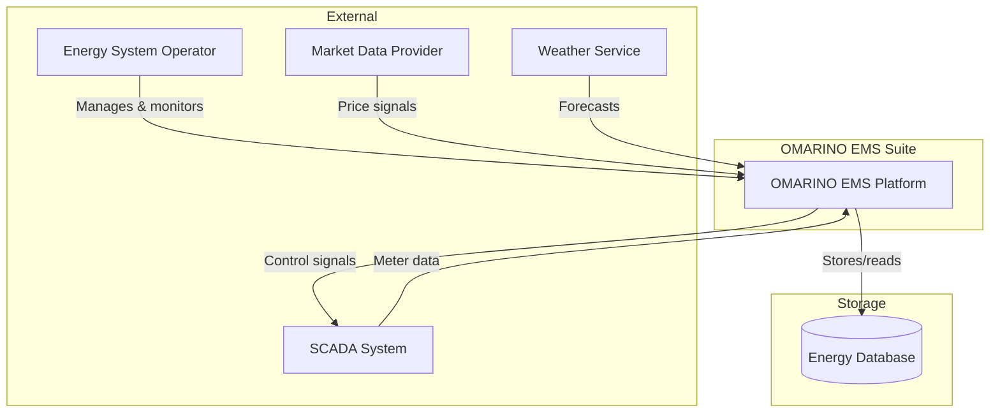
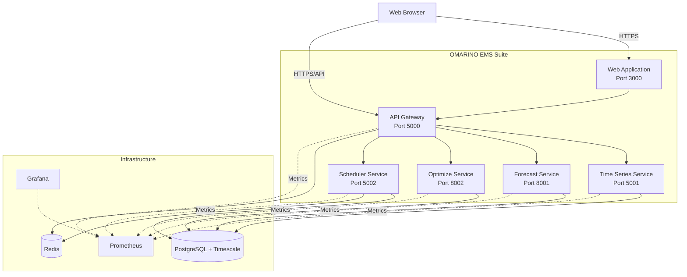
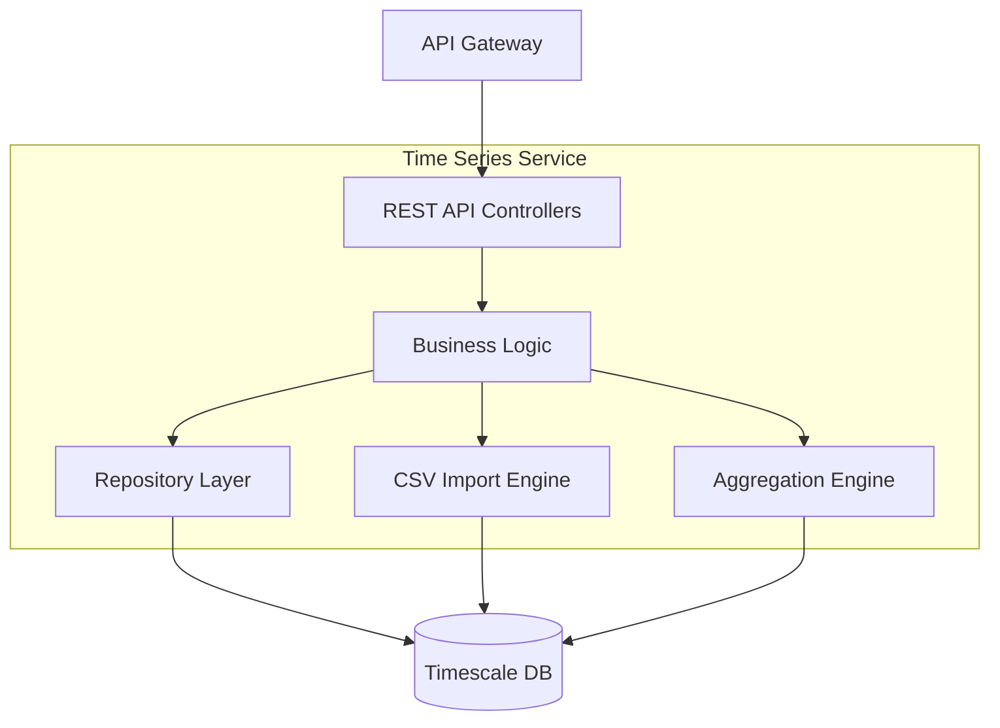

# Architecture Overview

## System Context (C4 Level 1)



## Container Diagram (C4 Level 2)



## Component Diagram (C4 Level 3) - Time Series Service



## Data Flow - E2E Workflow

```mermaid
sequenceDiagram
    participant O as Operator
    participant W as Web App
    participant G as API Gateway
    participant S as Scheduler
    participant TS as Time Series
    participant FC as Forecast
    participant OPT as Optimize
    participant DB as PostgreSQL
    
    O->>W: Define DAG workflow
    W->>G: POST /scheduler/dags
    G->>S: Create DAG
    S->>DB: Save DAG definition
    
    Note over S: Cron trigger fires
    
    S->>TS: Import CSV data
    TS->>DB: Store time series
    TS-->>S: Import complete
    
    S->>FC: Request forecast
    FC->>DB: Fetch historical data
    FC->>FC: Run ML models
    FC->>DB: Store forecast series
    FC-->>S: Forecast complete
    
    S->>OPT: Request optimization
    OPT->>DB: Fetch forecasts + prices
    OPT->>OPT: Solve MILP
    OPT->>DB: Store schedule
    OPT-->>S: Optimization complete
    
    S->>S: Generate report
    S->>G: Webhook notification
    G->>W: Update UI
    W-->>O: Display results
```

## Technology Decisions

### Backend Services
- **ASP.NET Core 8** for API Gateway, Time Series, and Scheduler
  - Rationale: High performance, async I/O, native OpenTelemetry, mature ecosystem
- **Python 3.11 + FastAPI** for Forecast and Optimize services
  - Rationale: Rich ML/optimization libraries, type hints, automatic OpenAPI generation

### Database
- **PostgreSQL 16 + Timescale**
  - Rationale: ACID compliance, hypertables for time-series, continuous aggregates, mature

### Messaging
- **Redis**
  - Rationale: Simple setup, pub/sub + streams, used for job queues and caching

### Authentication
- **OpenID Connect (OIDC)**
  - Rationale: Industry standard, works with Keycloak/Auth0/Azure AD, token-based

### Observability
- **OpenTelemetry + Prometheus + Grafana**
  - Rationale: Vendor-neutral, distributed tracing, rich metrics, free and open-source

## Deployment Architecture

### Local Development
```
docker-compose.yml
├── PostgreSQL (5432)
├── Redis (6379)
├── API Gateway (5000)
├── Time Series Service (5001)
├── Forecast Service (8001)
├── Optimize Service (8002)
├── Scheduler Service (5002)
├── Web App (3000)
├── Prometheus (9090)
└── Grafana (3001)
```

### Production (Kubernetes - Optional)
- Services deployed as Kubernetes Deployments
- PostgreSQL via StatefulSet or managed service (AWS RDS, Azure Database)
- Ingress with TLS termination
- Horizontal Pod Autoscaling for stateless services
- Persistent volumes for models and outputs

## Security Architecture

### Authentication Flow
1. User authenticates with OIDC provider (Keycloak)
2. Receives JWT access token
3. Web app stores token in httpOnly cookie
4. API Gateway validates JWT signature and claims
5. Gateway attaches user context to downstream requests

### Authorization
- **Roles**: Admin, Operator, Viewer
- **Admin**: Full CRUD on all resources, manage users
- **Operator**: Create/run jobs, view all data
- **Viewer**: Read-only access to dashboards and reports

### Secrets Management
- Environment variables via `.env` (local)
- Docker secrets (Swarm)
- Kubernetes secrets (K8s)
- Never commit credentials to Git

## Scalability Considerations

### Time Series Service
- Timescale hypertables with 7-day chunks
- Partitioning by meter_id for large deployments
- Read replicas for queries
- Connection pooling (Npgsql)

### Forecast Service
- Stateless design; scale horizontally
- Model caching in Redis
- Batch inference for multiple series
- GPU support for deep learning models (optional)

### Optimize Service
- CPU-intensive; vertical scaling preferred
- Solve queue via Redis
- Warm-start solutions for incremental updates
- Time limits to prevent runaway solvers

### Scheduler Service
- Quartz.NET clustered mode (multiple instances)
- Job state in PostgreSQL
- Distributed locks for singleton jobs

## Data Model Overview

### Time Series
```
Meter → Series → TimeSeriesPoint
- Meter: Physical device metadata
- Series: Data stream (unit, sampling rate, timezone)
- Point: Individual measurement (timestamp, value, quality)
```

### Forecasts
```
Forecast → ForecastPoint
- Metadata: model, horizon, created_at
- Point: timestamp, point_value, p10, p50, p90
```

### Optimization
```
OptimizationRun → Schedule
- Inputs: assets, constraints, prices
- Outputs: dispatch schedule, objective value, solver stats
```

## Performance Targets

| Metric | Target |
|--------|--------|
| **Ingestion** | 100k points/sec per service instance |
| **Query Latency** | p95 < 500ms for 24h aggregated data |
| **Forecast Latency** | < 10s for 24h horizon (classical models) |
| **Optimize Latency** | < 60s for typical battery dispatch problem |
| **API Availability** | 99.9% uptime |

## Future Enhancements

- **Phase 2**: gRPC inter-service communication for performance
- **Phase 3**: Apache Kafka for high-throughput ingestion
- **Phase 4**: ClickHouse for ultra-fast analytics queries
- **Phase 5**: GraphQL federation for flexible queries
- **Phase 6**: WebAssembly rule packs for edge devices

---

**Next**: [ADR-0001 Architecture Selection](adr/0001-architecture-selection.md)
