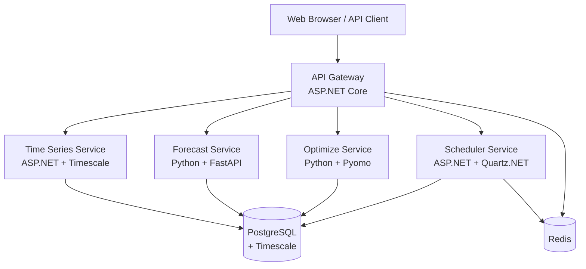

# OMARINO EMS Suite Documentation

Welcome to the OMARINO EMS Suite documentation – an open-source platform for energy management and energy data platform solutions.

## What is OMARINO EMS Suite?

OMARINO EMS Suite is a comprehensive, containerized microservices platform designed for modern energy management systems. It provides end-to-end capabilities for:

- **Time-series data management** with versioning and lineage tracking
- **Advanced forecasting** using classical, ML, and deep learning models
- **Mathematical optimization** for storage, dispatch, and procurement
- **Workflow orchestration** with JSON-defined DAGs
- **Extensible compliance** through pluggable rule packs
- **Web-based dashboards** with role-based access control

## Key Features

### 🔋 Energy Management
- Battery storage optimization (LP/MIP)
- Unit commitment and economic dispatch
- Virtual power plant (VPP) coordination
- Reserve and ancillary services planning

### 📈 Forecasting
- **Deterministic**: ARIMA, ETS, XGBoost, LightGBM
- **Probabilistic**: Quantile forecasts (p10/p50/p90)
- **Deep Learning**: N-HiTS neural forecasting
- Calendar and weather features
- Model explainability with SHAP

### ⏱️ Time Series
- High-performance ingestion (PostgreSQL + Timescale)
- Multi-resolution aggregations (15min, 1h, 1day)
- Data versioning and audit trails
- Quality flags and unit conversions
- DST-aware time handling

### 🔄 Orchestration
- JSON-defined DAG workflows
- Built-in tasks: import, forecast, optimize, report
- Retry policies and error handling
- Webhook notifications
- Cron and event-driven triggers

### 🛡️ Security & Compliance
- OpenID Connect (OIDC) authentication
- Role-based access control (RBAC)
- Audit logging
- Extensible rule packs for market regulations
- No credentials in code (Docker secrets)

### 📊 Observability
- OpenTelemetry instrumentation
- Prometheus metrics
- Grafana dashboards
- Distributed tracing
- Health/readiness probes

## Architecture Overview

## Quick Links

- **[Quick Start Guide](getting-started/quick-start.md)** – Get running in 5 minutes
- **[Architecture Deep Dive](architecture.md)** – System design and decisions
- **[API Reference](apis/timeseries.md)** – OpenAPI specs and examples
- **[E2E Runbook](runbook-e2e.md)** – Complete workflow walkthrough
- **[Developer Setup](developer-setup.md)** – Local development environment

## Technology Stack

| Layer | Technologies |
|-------|-------------|
| **Frontend** | Next.js 14, TypeScript, React 18, TailwindCSS |
| **API Gateway** | ASP.NET Core 8, JWT validation, rate limiting |
| **Backend Services** | ASP.NET Core 8, Python 3.11 + FastAPI |
| **Database** | PostgreSQL 16 + Timescale extension |
| **ML/Forecasting** | scikit-learn, statsmodels, neuralforecast |
| **Optimization** | Pyomo + HiGHS/CBC solvers |
| **Orchestration** | Quartz.NET (ASP.NET Core) |
| **Messaging** | Redis (queues/streams) |
| **Auth** | OpenID Connect / OAuth2 |
| **Observability** | OpenTelemetry, Prometheus, Grafana |
| **Testing** | xUnit, pytest, Playwright |
| **CI/CD** | GitHub Actions |
| **Containers** | Docker + Docker Compose |

## Use Cases

### Energy Utilities
- Load forecasting and balancing
- Renewable integration (PV/wind)
- Demand response programs
- Grid congestion management

### Industrial Facilities
- Energy cost optimization
- Peak shaving with storage
- On-site generation scheduling
- Demand charge reduction

### Renewable Operators
- Production forecasting
- Market participation strategies
- Curtailment minimization
- Revenue optimization

### Energy Traders
- Price forecasting
- Portfolio optimization
- Risk management (CVaR)
- Settlement calculations

## Next Steps

1. **[Install Prerequisites](getting-started/quick-start.md#prerequisites)**
2. **[Run the Platform](getting-started/quick-start.md#installation)**
3. **[Follow the E2E Demo](runbook-e2e.md)**
4. **[Explore the APIs](apis/timeseries.md)**
5. **[Set Up Development Environment](developer-setup.md)**

## Support & Community

- **GitHub Issues**: [Report bugs or request features](https://github.com/YOUR_USERNAME/omarino-ems-suite/issues)
- **GitHub Discussions**: [Ask questions and share ideas](https://github.com/YOUR_USERNAME/omarino-ems-suite/discussions)
- **Documentation**: You're reading it! 📖

## License

OMARINO EMS Suite is open-source software licensed under the [MIT License](https://github.com/YOUR_USERNAME/omarino-ems-suite/blob/main/LICENSE).

---

**Ready to get started?** Head over to the [Quick Start Guide](getting-started/quick-start.md) →
